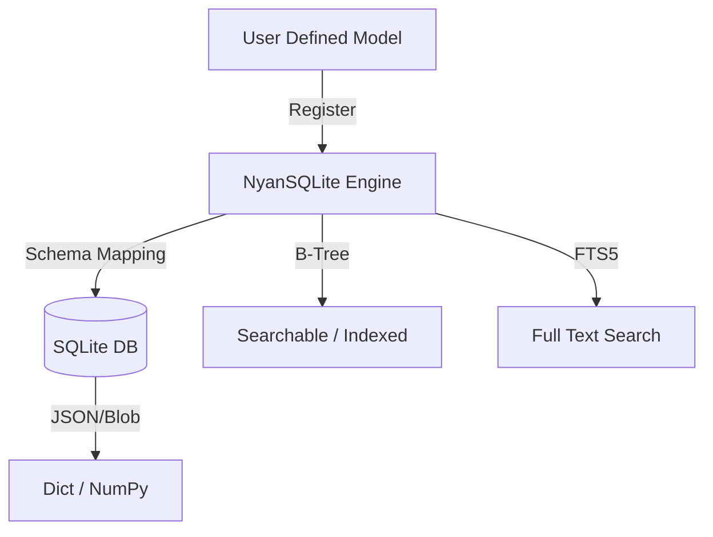

NanaSQLiteの進化系として、より構造化されたデータ管理と高度な検索に特化した「NyanSQLite」用のREADME.mdを作成しました。
Pydanticの強力なバリデーションとSQLiteの高速な検索性能（FTS5）を融合させた、モダンな開発者向けのドキュメント構成にしています。

---

# NyanSQLite

[](https://pypi.org/project/nyansqlite/)
[](https://pypi.org/project/nyansqlite/)
[](https://opensource.org/licenses/MIT)

**A type-safe, high-performance SQLite wrapper powered by Pydantic and FTS5.**

[English](#english) | [日本語](#日本語)

---

## 日本語

NyanSQLiteは、Pydanticモデルをそのままデータベースのスキーマとして利用できる、型安全なSQLiteラッパーです。
SQLを意識することなく、Djangoライクな直感的なクエリや、SQLiteの強力な全文検索エンジン（FTS5）を最大限に活用できます。

### 🚀 主な特徴

*   **Pydanticベースのスキーマ定義**: 型ヒントを利用した自動バリデーションと、シームレスなデータ変換
*   **Djangoライクなクエリ演算子**: `__gte` や `__contains` を使った直感的なフィルタリング
*   **高速な全文検索 (FTS5)**: 大規模なテキストデータからの爆速検索を標準サポート
*   **インデックスの自動管理**: `Indexed` アノテーションによるB-treeインデックスの自動構築
*   **柔軟なデータ保存**: `dict` や `numpy.ndarray` といった複雑な型を透明に処理
*   **パフォーマンス最適化**: WALモードやバッチ処理（Bulk Insert）による高い書き込み性能

### 📦 インストール

```bash
pip install nyansqlite
```

### 🏗️ アーキテクチャ



### ⚡ クイックスタート

以下のコード一つで、定義・登録・挿入・検索・更新のすべてが完結します。

```python
from __future__ import annotations
from pydantic import BaseModel, ConfigDict
from typing import Optional, Dict, Any
import numpy as np

from nyansqlite import NyanSQLite, Indexed, Searchable

# --- 1. スキーマ定義 ---
class Article(BaseModel):
    model_config = ConfigDict(arbitrary_types_allowed=True)
    
    id: Optional[int] = None           # 主キー（自動採番）
    author: Indexed[str]               # B-tree インデックス対象
    title: Searchable[str]             # 全文検索対象
    body: Searchable[str]              # 全文検索対象
    tags: Indexed[str]                 # タグ検索用インデックス
    metadata: Dict[str, Any]           # 内部で自動的にJSON変換
    views: int = 0

# --- 2. データベースの初期化とデータ登録 ---
db = NyanSQLite("nyan_database.db")
db.register(Article)

# バッチ処理による高速な挿入
db.insert_many([
    Article(
        author="neko_sensei",
        title="NyanSQLite活用術",
        body="PydanticとSQLiteを組み合わせることで、開発効率が劇的に向上します。",
        tags="python,sqlite",
        metadata={"category": "tech"}
    ),
    Article(
        author="kuro",
        title="SQLite FTS5の魔法",
        body="高速な全文検索をあなたのPythonアプリに導入しましょう。",
        tags="database,sql",
        metadata={"category": "tips"}
    )
])

# --- 3. Django風のクエリ実行 ---
# IDが大きく、かつタグに "python" を含む記事を抽出
print("--- [Filter Results] ---")
posts = db.query(
    Article, 
    id__gte=1,
    tags__contains="python",
    order_by="id",
    desc=True
)
for p in posts:
    print(f"[{p.author}] {p.title}")

# --- 4. パワフルな全文検索 (FTS5) ---
print("\n--- [Full Text Search Results] ---")
results = db.search(Article, "SQLite 魔法")
for hit in results:
    print(f"Match found: {hit.title}")

db.close()
```

### 🔧 便利なクエリ演算子

NyanSQLiteでは以下の演算子が利用可能です。

*   `field=value`: 完全一致
*   `field__contains="word"`: 部分一致
*   `field__in=[1, 2, 3]`: 複数値のいずれかに一致
*   `field__gte=10`: 指定値以上
*   `field__lte=10`: 指定値以下

### 📚 メンテナンス

データベースの最適化やクリーンアップも簡単です。

```python
db.vacuum()  # データベースファイルの断片化を解消
```

---

## English

NyanSQLite is a type-safe, high-performance SQLite wrapper that uses Pydantic models as database schemas. Enjoy the power of SQLite's FTS5 engine and Django-like queries without writing complex SQL.

### 🚀 Features

- **Pydantic Schemas**: Type-safe data validation and automatic conversion.
- **Django-like Query Syntax**: Intuitive filtering using `__gte`, `__contains`, etc.
- **FTS5 Integration**: Built-in high-speed full-text search.
- **Auto-Indexing**: Simplified B-tree index management via `Indexed` annotation.
- **Advanced Data Handling**: Transparent support for `dict`, `list`, and `numpy.ndarray`.
- **High Throughput**: Optimized for speed with WAL mode and bulk operations.

---

## License

MIT License - see [LICENSE](LICENSE) for details.