<!--
━━━━━━━━━━━━━━━━━━━━━━━━━━━━━━━━━━━━━━━━━━━━━━━━━━━━━━━━━━━━
🤖 AI ENTRY POINT — まずここだけ読め（このブロックは約50行）
━━━━━━━━━━━━━━━━━━━━━━━━━━━━━━━━━━━━━━━━━━━━━━━━━━━━━━━━━━━━

あなたは: シニアセキュリティアーキテクト
プロジェクト: nyansqlite
生成日時: 2026-05-15 21:00:15

あなたの仕事:
  このレポートを読み、脆弱性を発見し、[OUTPUT]形式で統合レポートを出力すること

▼ 作業手順（この順番で進めよ）

  STEP 1 → [TRIAGE]      を読む  … システム全体像・信頼境界の把握
  STEP 2 → [HOTMAP]      を読む  … 読む関数を自分で絞り込む
  STEP 3 → [CALLCHAIN]   を読む  … データが流れる経路を追跡する
  STEP 4 → [BLIND]       を読む  … 静的解析が見落とす領域を推論する
  STEP 5 → 必要なら[CHUNKS目次]で行番号を確認し、その箇所だけ参照する
  STEP 6 → [OUTPUT]形式で統合レポートを1本出力する

⚠️ 読まなくていいもの（時間とトークンの無駄）
  - cc=1 の AsyncWrapper 群・抽象基底クラスの stub（SKIP 指定済み）
  - [CHUNKS目次] の全行 → 必要なチャンクだけ参照せよ
  - CVEリスト・静的解析スコア → このレポートには存在しない。AIの推論で代替する

💡 推奨戦略
  TIER-1（1関数）だけ読めば主要リスクの8割はカバーできる。
  推奨読み込み範囲: TIER-1 + TIER-2 = 5関数 / 全58チャンク中

▶ では [TRIAGE] セクションへ進め
━━━━━━━━━━━━━━━━━━━━━━━━━━━━━━━━━━━━━━━━━━━━━━━━━━━━━━━━━━━━
-->

# Python セキュリティ構造マップ v6 (AI-Native Edition)

> 対象: `src\nyansqlite` — 5ファイル / 58チャンク
> 生成: 2026-05-15 21:00:15
> ⚠️ ソースコードを含みません。構造・シグネチャ・呼び出しグラフのみです。
> CVEマッチングは行いません。AIの文脈推論に完全委譲します。

| 項目 | 値 |
|:---|---:|
| 解析ファイル | 5 |
| 総チャンク数 | 58 |
| 🔴 TIER-1（必読） | 1 |
| 🟠 TIER-2（文脈依存） | 4 |
| 🟡 TIER-3（参考） | 8 |
| ⬜ SKIP（読む必要なし） | 45 |

## 📑 セクション目次

| セクション | 内容 | 読むべきか |
|:---|:---|:---:|
| [TRIAGE]     | 信頼境界・アーキテクチャ・暗号化・非同期モデル | ✅ 必読 |
| [HOTMAP]     | 優先関数リスト TIER-1〜3・スキップ対象 | ✅ 必読 |
| [CALLCHAIN]  | データフロー追跡（書き込み/クエリ/暗号化/ファイル） | ✅ 必読 |
| [BLIND]      | 静的解析の盲点 7カテゴリ | ✅ 必読 |
| [CHUNKS目次] | 全チャンクの関数名・行範囲・cc・TIER | 🔍 必要時のみ |
| [CHUNKS本体] | 各チャンクの詳細（TIER-1→2→3→SKIP順） | 🔍 TIER-1のみ推奨 |
| [OUTPUT]     | 統合レポートの出力フォーマット定義 | ✅ 最後に参照 |

---

## [TRIAGE] — システム全体像と信頼境界

### 解析対象ファイル

```
  _connection.py
  _markers.py
  _schema.py
  _types.py
  core.py
```

### 検出クラス一覧

```
  CompositeIndex
  Indexed
  NyanConnection
  NyanSQLite
  Searchable
  UniqueIndexed
  _Meta
  _NyanIndexedMarker
  _NyanSearchableMarker
```

### 信頼境界（外部入力が触れる引数キーワード）

```
このコードベースで検出された危険な引数名:
  order_by, path, query, sql, table, value, where

リスクカテゴリ別:
  sql, query, expr, where, order_by, group_by
      → SQL インジェクション系
  key, value
      → KV ストア操作・シリアライズ
  table_name, column_name, identifier
      → DDL/DML での identifier injection
  path, src_path, dest_path
      → ファイルシステム操作・パストラバーサル
  pragma_name
      → PRAGMA injection
  encryption_key
      → 暗号鍵の管理・保管
```

### アーキテクチャ概要（解析から推定）

```
外部コード
  │
  ├─ AsyncNanaSQLite     ← asyncio ラッパー層
  │    ほぼ全メソッドが run_in_executor で NanaSQLite に委譲
  │
  ├─ NanaSQLite          ← 本体・全ロジックはここ
  │   ├─ Cache 層        UnboundedCache / StdLRUCache
  │   │                  FastLRUCache / TTLCache / ExpiringDict
  │   ├─ Hook 層         CheckHook / UniqueHook / ForeignKeyHook
  │   │                  PydanticHook / ValidkitHook
  │   └─ V2Engine        非同期書き込みキュー + DLQ
  │
  └─ apsw（SQLite）      ← 標準 sqlite3 より低レベルなバインディング
```

### 非同期書き込みモデル（V2Engine）

```
write 要求
  → kvs_set()        staging dict に積む（メモリ）
  → _check_auto_flush()
  → flush()          ThreadPoolExecutor で非同期実行
  → _perform_flush()
  → _process_kvs_chunk()  apsw cursor.executemany
  → 失敗時 → _recover_chunk_via_dlq() → _add_to_dlq()

重要: staging 中のデータは SQLite に未反映
      close() / read() との競合タイミングが存在する
```

---

## [HOTMAP] — 読む関数の優先度リスト

### 🔴 TIER-1: 必読（cc≥18 または 信頼境界直結の高リスク関数）

| 関数名 | ChunkID | cc | 場所 |
|:---|:---:|:---:|:---|
| `_build_where` | C030 | 23 | `core.py:33` |


### 🟠 TIER-2: 文脈依存（呼び出し関係で危険になりうる関数）

| 関数名 | ChunkID | cc | 場所 |
|:---|:---:|:---:|:---|
| `deserialize_value` | C029 | 11 | `_types.py:103` |
| `NyanConnection._raw` | C001 | 9 | `_connection.py:51` |
| `model_to_indexes` | C020 | 9 | `_schema.py:63` |
| `NyanSQLite.register` | C036 | 8 | `core.py:201` |


### 🟡 TIER-3: 参考（cc 4〜7、文脈によっては重要）

| 関数名 | ChunkID | cc | 場所 |
|:---|:---:|:---:|:---|
| `serialize_value` | C028 | 7 | `_types.py:85` |
| `model_to_fts5` | C021 | 6 | `_schema.py:99` |
| `resolve_type` | C025 | 6 | `_types.py:39` |
| `NyanSQLite.insert_many` | C041 | 5 | `core.py:278` |
| `NyanSQLite.select` | C046 | 5 | `core.py:400` |
| `NyanConnection.__init__` | C000 | 4 | `_connection.py:27` |
| `model_to_ddl` | C019 | 4 | `_schema.py:39` |
| `is_indexed` | C022 | 4 | `_types.py:17` |


### ⬜ SKIP推奨（45個）

```
CompositeIndex, Indexed, NyanConnection, NyanSQLite, Searchable, UniqueIndexed, _Meta, _NyanIndexedMarker, _NyanSearchableMarker, _is_union_type ... 他8クラス
理由: cc=1 のラッパー・pass のみの stub・run_in_executor 委譲のみ
```

---

## [CALLCHAIN] — データフロー追跡

### フロー① KV書き込みパス

```
外部入力: key, value
  ↓


【AIが推論すべき問い】
  Q1: hook.before_write が例外を投げた後、V2 staging の状態は？
  Q2: staging 中に close() されたら未 flushed データはどうなる？
  Q3: UniqueHook が index 更新後に DB 書き込みが失敗した場合の整合性は？
  Q4: DLQ エントリにはどの情報が含まれ、外部に見えるか？
```

### フロー② クエリ実行パス（SQLインジェクション系）

```
外部入力: table_name, where, order_by, group_by, columns
  ↓
  NyanConnection.execute [C002, cc=1]
  NyanConnection.executemany [C003, cc=2]
  NyanSQLite.query [C045, cc=3]
  NyanSQLite.execute_raw [C052, cc=1]

【AIが推論すべき問い】
  Q1: order_by / group_by はパラメータ化されているか？直接埋め込みか？
  Q2: @lru_cache された _sanitize_identifier はキャッシュ汚染可能か？
  Q3: override_allowed=True を外部から制御できるか？
  Q4: _extract_column_aliases での AS 句パースはインジェクション耐性があるか？
```

### フロー③ 暗号化パス

```
外部入力: value（書き込み）/ DB raw bytes（読み込み）
  ↓


write: value → JSON 化 → encrypt(Fernet/AES-GCM/ChaCha20) → DB
read:  DB → decrypt → json.loads(★任意データ) → value

【AIが推論すべき問い】
  Q1: nonce = os.urandom(12) の一意性は大量書き込み時に十分か？
  Q2: 暗号化なし→あり移行時、混在データの _deserialize はどう動くか？
  Q3: DB が外部から書き換えられた場合、json.loads への影響は？
  Q4: 復号失敗時のエラーハンドリングは情報を漏洩しないか？
```

### フロー④ ファイル操作パス（backup / restore）

```
外部入力: dest_path（backup）/ src_path（restore）
  ↓


backup:  stat → samefile → apsw.Connection(dest) → backup.step(-1)
restore: stat → close() → mkstemp → copyfileobj → rename → 再接続 → 子通知

【AIが推論すべき問い】
  Q1: src_path にパストラバーサル（../etc/passwd）は防げるか？
  Q2: restore 中に別スレッドが DB 操作した場合の影響は？
  Q3: restore で V2Engine の staging データが消えるのは意図した動作か？
  Q4: WeakSet で管理された child への通知が GC で消えた場合は？
  Q5: tempfile のパーミッションが元 DB より緩い場合の rename 前リスクは？
```

---

## [BLIND] — 静的解析が見落とす7領域

### B1: 状態機械の不整合（V2Engine × キャッシュ）
```
検証対象: [未検出] × [未検出]

_ensure_cached は staging → DB の順に確認するが
flush 実行中にread が来た場合、staging から消えて DB にまだ書かれていない
「データが存在しない」ように見える瞬間が発生する可能性がある。
```

### B2: Hookチェーンの原子性
```
検証対象: [未検出] × [未検出]

hook1.before_write → 成功・副作用あり（UniqueHook が index を更新）
hook2.before_write → 例外発生
→ hook1 の副作用（_value_to_key dict 更新）はロールバックされない
  DB 書き込みは行われないが、メモリ上のインデックスが汚染される。
```

### B3: WeakrefによるGCハザード
```
AsyncNanaSQLite._child_instances = weakref.WeakSet()
UniqueHook._bound_db_ref = weakref.ref(db)

検証対象: UniqueHook.before_write での _bound_db_ref() が None を返す場合
          close() / _mark_parent_closed() の WeakSet 反復中の GC
```

### B4: lru_cache × セキュリティ境界
```
検証対象: [未検出]

@lru_cache はプロセス全体で共有される。
複数の NanaSQLite インスタンスが同一プロセス内に存在する場合、
検証結果が異なるコンテキストに誤って再利用される可能性がある。
また、悪意ある identifier を先にキャッシュさせるキャッシュ毒入り攻撃。
```

### B5: スレッドとasyncioの混在
```
検証対象: [未検出] × [未検出]

ExpiringDict._set_timer() は状況に応じて
  asyncio ループあり → loop.call_later()
  なし              → threading.Timer()

_evict() が on_expire → _delete_from_db_on_expire を呼ぶ際、
呼び出しスレッドと DB 操作スレッドが異なる場合の安全性を検証せよ。
```

### B6: DLQからの情報漏洩
```
検証対象: [未検出] → [未検出]

DLQ エントリに含まれる可能性のある情報:
  error_msg（例外メッセージ・スタックトレース含む可能性）
  table_name（内部テーブル名）
  key / value（失敗した書き込みデータ）
  action / timestamp

get_dlq() はこのリストをそのまま呼び出し元に返す。
アクセス制御が存在するか確認せよ。
```

### B7: atexit登録の競合とシャットダウン順序
```
検証対象: [未検出] → [未検出] × [未検出]

V2Engine.__init__ で atexit.register(self.shutdown) を登録。
複数インスタンスが存在する場合、シャットダウン順序は LIFO。
→ 子より先に親が shutdown され、子の V2Engine が孤立する可能性。
→ 既に close() 済みのインスタンスの atexit が後から走るリスク。
```

---

## [CHUNKS目次] — 全チャンク索引（必要時のみ参照）

> TIER-1以外は原則スキップせよ。行番号で直接ジャンプせよ。


### 🔴 TIER-1 必読

| ChunkID | 関数名 | 行範囲 | cc | ファイル |
|:---:|:---|:---:|:---:|:---|
| C030 | `_build_where` | L33-L119 | 23 | core.py |

### 🟠 TIER-2 文脈依存

| ChunkID | 関数名 | 行範囲 | cc | ファイル |
|:---:|:---|:---:|:---:|:---|
| C029 | `deserialize_value` | L103-L157 | 11 | _types.py |
| C001 | `NyanConnection._raw` | L51-L76 | 9 | _connection.py |
| C020 | `model_to_indexes` | L63-L94 | 9 | _schema.py |
| C036 | `NyanSQLite.register` | L201-L241 | 8 | core.py |

### 🟡 TIER-3 参考

| ChunkID | 関数名 | 行範囲 | cc | ファイル |
|:---:|:---|:---:|:---:|:---|
| C028 | `serialize_value` | L85-L100 | 7 | _types.py |
| C021 | `model_to_fts5` | L99-L151 | 6 | _schema.py |
| C025 | `resolve_type` | L39-L52 | 6 | _types.py |
| C041 | `NyanSQLite.insert_many` | L278-L290 | 5 | core.py |
| C046 | `NyanSQLite.select` | L400-L437 | 5 | core.py |
| C000 | `NyanConnection.__init__` | L27-L47 | 4 | _connection.py |
| C019 | `model_to_ddl` | L39-L58 | 4 | _schema.py |
| C022 | `is_indexed` | L17-L23 | 4 | _types.py |

### ⬜ SKIP 読まなくてよい

| ChunkID | 関数名 | 行範囲 | cc | ファイル |
|:---:|:---|:---:|:---:|:---|
| C005 | `NyanConnection.changes` | L101-L106 | 3 | _connection.py |
| C017 | `get_primary_key` | L23-L30 | 3 | _schema.py |
| C023 | `is_searchable` | L26-L29 | 3 | _types.py |
| C031 | `_order_sql` | L122-L125 | 3 | core.py |
| C032 | `_limit_sql` | L128-L134 | 3 | core.py |
| C034 | `_Meta.check_fields` | L156-L162 | 3 | core.py |
| C038 | `NyanSQLite._to_row` | L254-L257 | 3 | core.py |
| C042 | `NyanSQLite.update` | L294-L325 | 3 | core.py |
| C045 | `NyanSQLite.query` | L360-L396 | 3 | core.py |
| C047 | `NyanSQLite.search` | L441-L479 | 3 | core.py |
| C003 | `NyanConnection.executemany` | L81-L85 | 2 | _connection.py |
| C004 | `NyanConnection.transaction` | L90-L97 | 2 | _connection.py |
| C014 | `CompositeIndex.__init__` | L76-L80 | 2 | _markers.py |
| C015 | `CompositeIndex.__repr__` | L82-L84 | 2 | _markers.py |
| C024 | `unwrap_annotated` | L32-L36 | 2 | _types.py |
| C027 | `python_type_to_sqlite` | L75-L80 | 2 | _types.py |
| C037 | `NyanSQLite._meta` | L243-L250 | 2 | core.py |
| C039 | `NyanSQLite._from_row` | L259-L262 | 2 | core.py |
| C040 | `NyanSQLite.insert` | L266-L276 | 2 | core.py |
| C044 | `NyanSQLite.get` | L348-L358 | 2 | core.py |
| C048 | `NyanSQLite.count` | L483-L497 | 2 | core.py |
| C050 | `NyanSQLite.rebuild_fts` | L517-L525 | 2 | core.py |
| C057 | `NyanSQLite.registered_models` | L559-L561 | 2 | core.py |
| C002 | `NyanConnection.execute` | L78-L79 | 1 | _connection.py |
| C006 | `NyanConnection.close` | L108-L109 | 1 | _connection.py |
| C007 | `NyanConnection.backend` | L112-L113 | 1 | _connection.py |
| C008 | `_NyanIndexedMarker.__init__` | L7-L8 | 1 | _markers.py |
| C009 | `_NyanIndexedMarker.__repr__` | L10-L11 | 1 | _markers.py |
| C010 | `_NyanSearchableMarker.__repr__` | L15-L16 | 1 | _markers.py |
| C011 | `Indexed.__class_getitem__` | L28-L30 | 1 | _markers.py |
| C012 | `UniqueIndexed.__class_getitem__` | L41-L43 | 1 | _markers.py |
| C013 | `Searchable.__class_getitem__` | L55-L57 | 1 | _markers.py |
| C016 | `model_to_table_name` | L18-L20 | 1 | _schema.py |
| C018 | `model_hints` | L33-L34 | 1 | _schema.py |
| C026 | `_is_union_type` | L55-L57 | 1 | _types.py |
| C033 | `_Meta.__init__` | L142-L154 | 1 | core.py |
| C035 | `NyanSQLite.__init__` | L194-L197 | 1 | core.py |
| C043 | `NyanSQLite.delete` | L329-L344 | 1 | core.py |
| C049 | `NyanSQLite.exists` | L499-L513 | 1 | core.py |
| C051 | `NyanSQLite.vacuum` | L527-L529 | 1 | core.py |
| C052 | `NyanSQLite.execute_raw` | L533-L540 | 1 | core.py |
| C053 | `NyanSQLite.__enter__` | L544-L545 | 1 | core.py |
| C054 | `NyanSQLite.__exit__` | L547-L548 | 1 | core.py |
| C055 | `NyanSQLite.close` | L550-L552 | 1 | core.py |
| C056 | `NyanSQLite.backend` | L555-L557 | 1 | core.py |

---

## [CHUNKS本体] — チャンク詳細（TIER-1→2→3→SKIP順）


### 🔴 TIER-1 必読 チャンク群


---

#### C030 🔴 `_build_where`

> `core.py` L33-L119 | cc=23 | taint=.→T
> 呼び出し元: `NyanSQLite.update`, `NyanSQLite.delete`, `NyanSQLite.query`, `NyanSQLite.select`, `NyanSQLite.count` 他1件

**シグネチャ**:
```
_build_where(args, kwargs) -> tuple[str, list[Any]]  [cc=23] [.→T]
```

**呼び出しグラフ**:
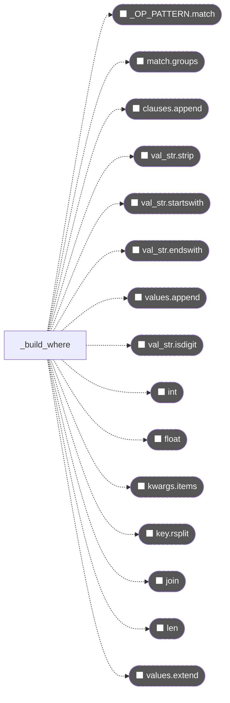


### 🟠 TIER-2 文脈依存 チャンク群


---

#### C029 🟠 `deserialize_value`

> `_types.py` L103-L157 | cc=11 | taint=T→T
> 呼び出し元: `NyanSQLite._from_row`, `NyanSQLite.select`

**シグネチャ**:
```
deserialize_value(value, annotation) -> Any  [cc=11] [T→T]
```

**呼び出しグラフ**:
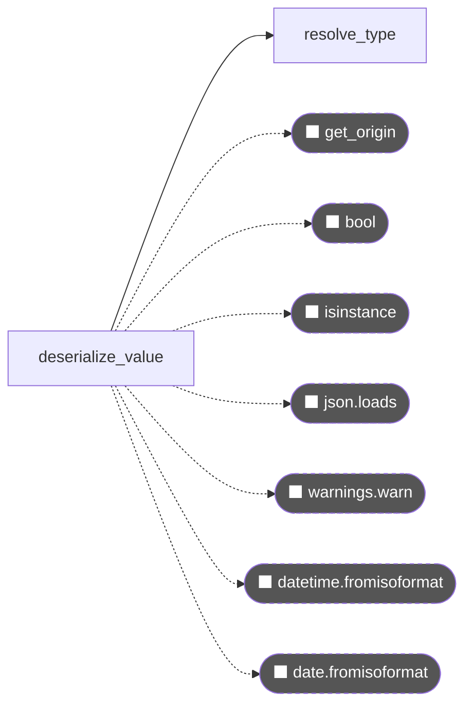


---

#### C001 🟠 `NyanConnection._raw`

> `_connection.py` L51-L76 | cc=9 | taint=T→T

**シグネチャ**:
```
NyanConnection._raw(self, sql, params) -> list[dict[str, Any]]  [cc=9] [T→T]
```

**呼び出しグラフ**:
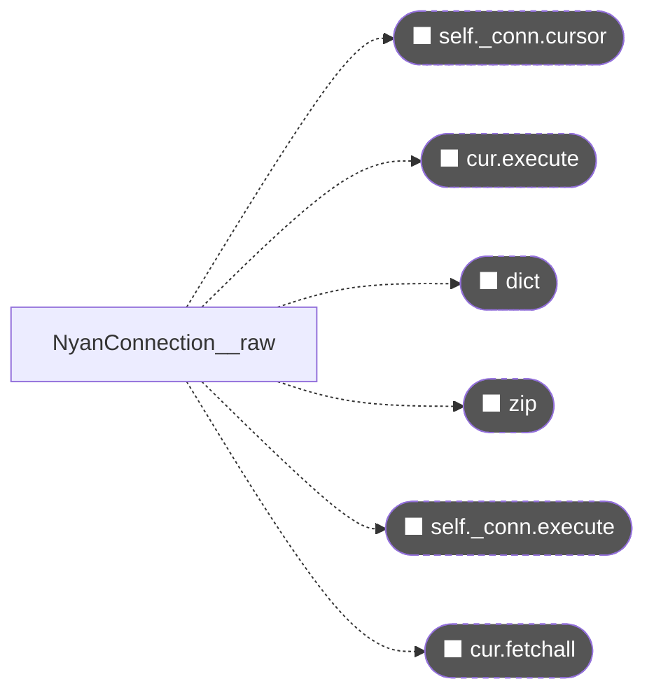


---

#### C020 🟠 `model_to_indexes`

> `_schema.py` L63-L94 | cc=9 | taint=.→T
> 呼び出し元: `NyanSQLite.register`

**シグネチャ**:
```
model_to_indexes(model) -> list[str]  [cc=9] [.→T]
```

**呼び出しグラフ**:
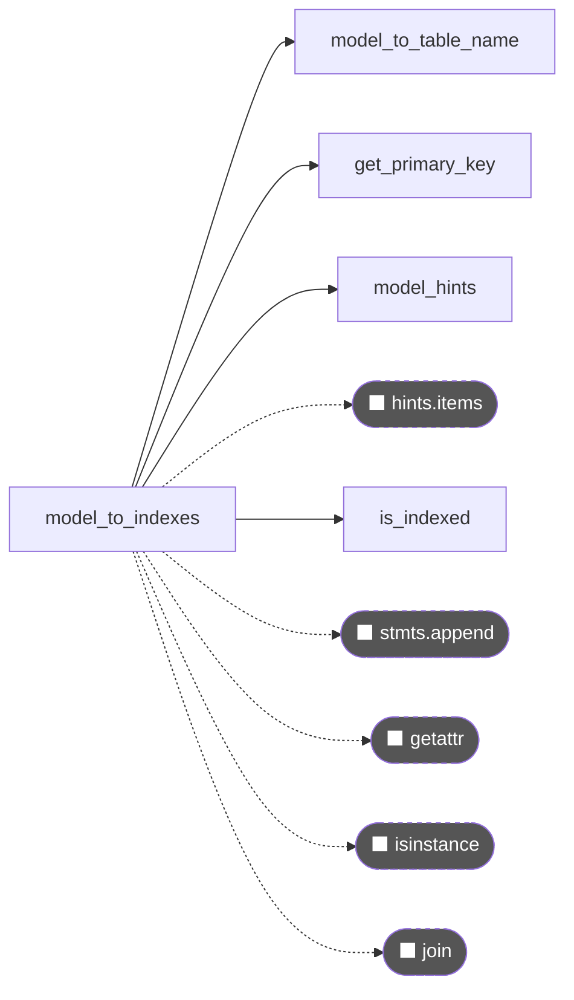


---

#### C036 🟠 `NyanSQLite.register`

> `core.py` L201-L241 | cc=8 | taint=.→.

**シグネチャ**:
```
NyanSQLite.register(self, model) -> None  [cc=8] [.→.]
```

**呼び出しグラフ**:
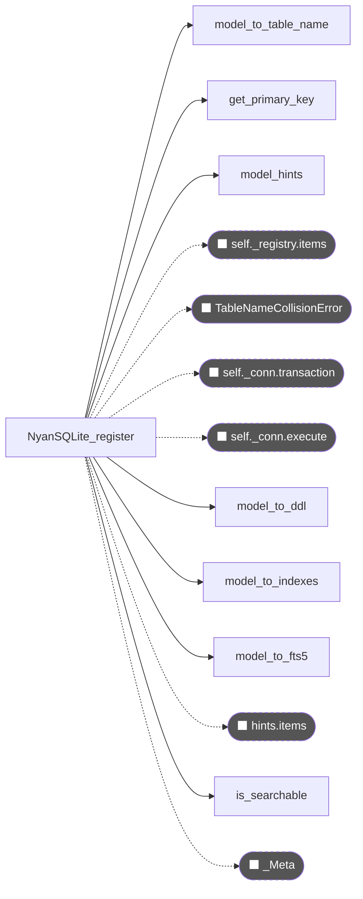


### 🟡 TIER-3 参考 チャンク群


---

#### C028 🟡 `serialize_value`

> `_types.py` L85-L100 | cc=7 | taint=T→T
> 呼び出し元: `NyanSQLite._to_row`, `NyanSQLite.update`

**シグネチャ**:
```
serialize_value(value, annotation) -> Any  [cc=7] [T→T]
```

**呼び出しグラフ**:
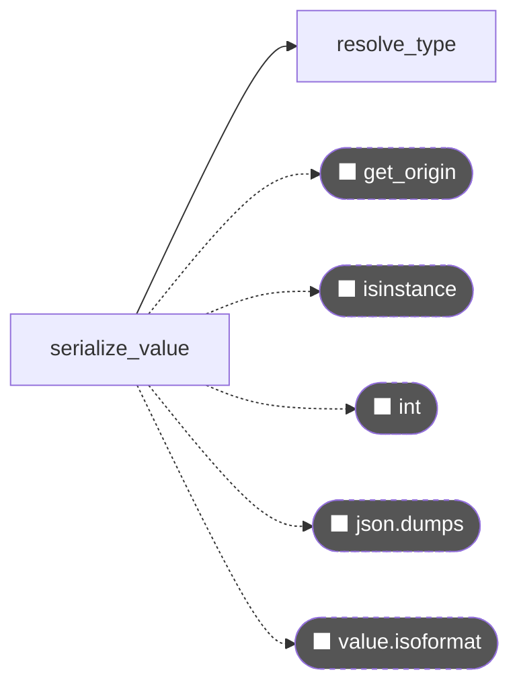


---

#### C021 🟡 `model_to_fts5`

> `_schema.py` L99-L151 | cc=6 | taint=.→T
> 呼び出し元: `NyanSQLite.register`

**シグネチャ**:
```
model_to_fts5(model) -> tuple[Optional[str], list[str]]  [cc=6] [.→T]
```

**呼び出しグラフ**:
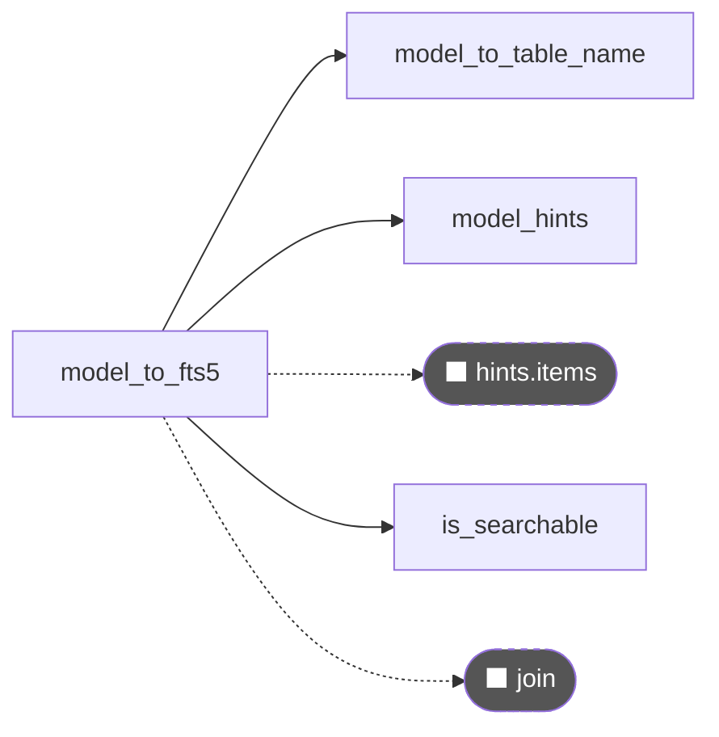


---

#### C025 🟡 `resolve_type`

> `_types.py` L39-L52 | cc=6 | taint=.→T
> 呼び出し元: `model_to_ddl`, `python_type_to_sqlite`, `serialize_value`, `deserialize_value`

**シグネチャ**:
```
resolve_type(annotation) -> tuple[Any, bool]  [cc=6] [.→T]
```

**呼び出しグラフ**:
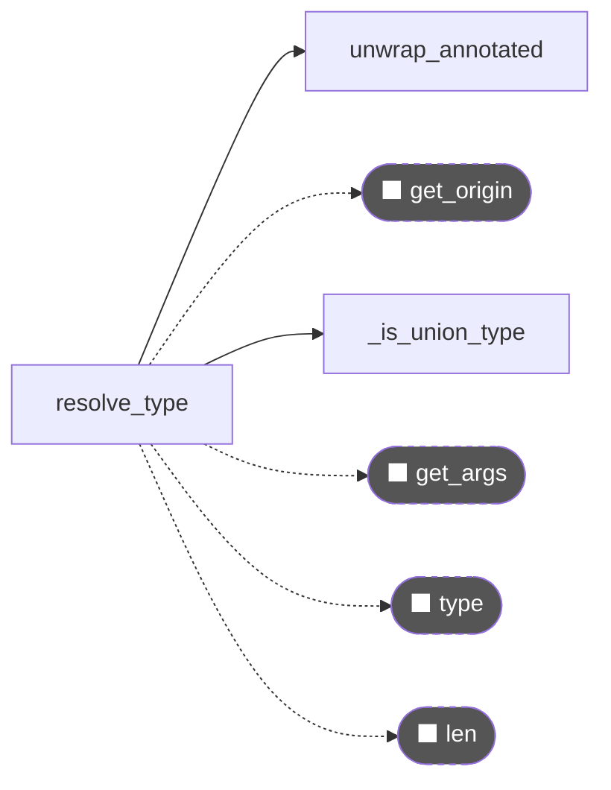


---

#### C041 🟡 `NyanSQLite.insert_many`

> `core.py` L278-L290 | cc=5 | taint=.→.

**シグネチャ**:
```
NyanSQLite.insert_many(self, objs) -> int  [cc=5] [.→.]
```

**呼び出しグラフ**:
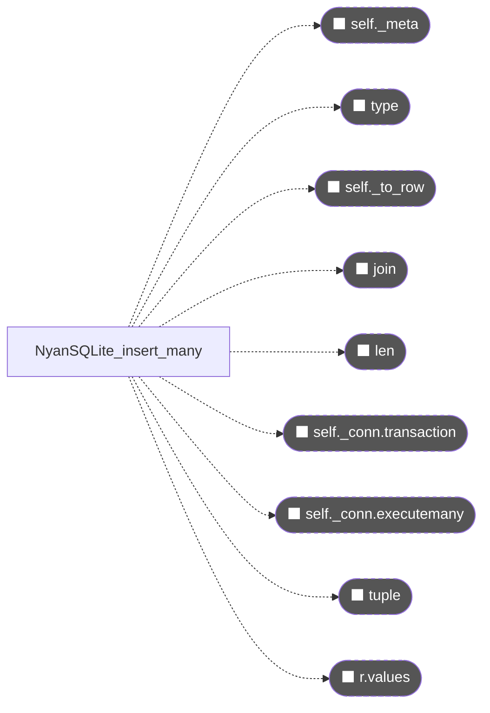


---

#### C046 🟡 `NyanSQLite.select`

> `core.py` L400-L437 | cc=5 | taint=.→T

**シグネチャ**:
```
NyanSQLite.select(self, model, fields) -> list[dict[str, Any]]  [cc=5] [.→T]
```

**呼び出しグラフ**:
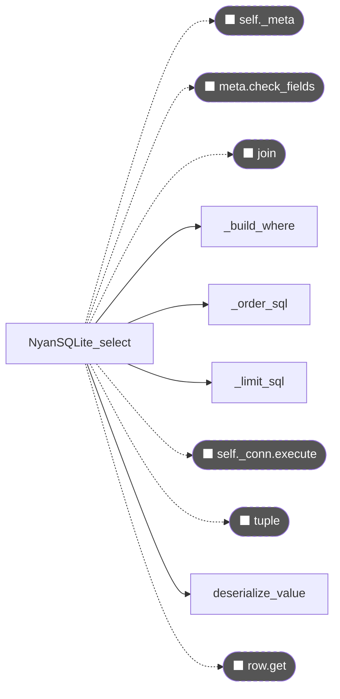


---

#### C000 🟡 `NyanConnection.__init__`

> `_connection.py` L27-L47 | cc=4 | taint=T→.

**シグネチャ**:
```
NyanConnection.__init__(self, path, wal) -> ?  [cc=4] [T→.]
```

**呼び出しグラフ**:
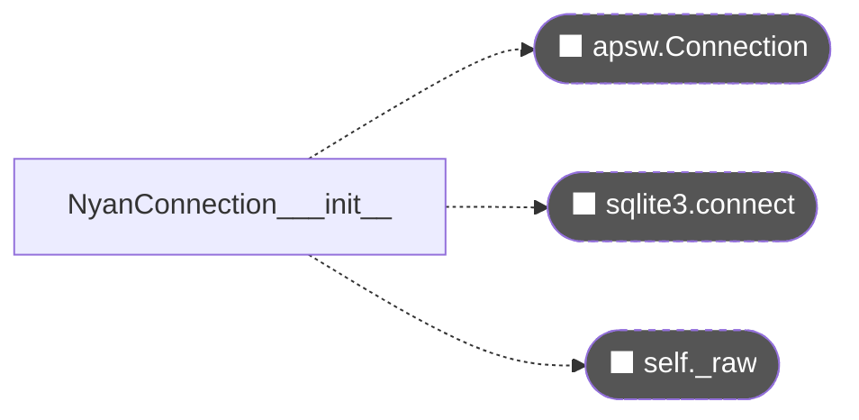


---

#### C019 🟡 `model_to_ddl`

> `_schema.py` L39-L58 | cc=4 | taint=.→T
> 呼び出し元: `NyanSQLite.register`

**シグネチャ**:
```
model_to_ddl(model) -> str  [cc=4] [.→T]
```

**呼び出しグラフ**:
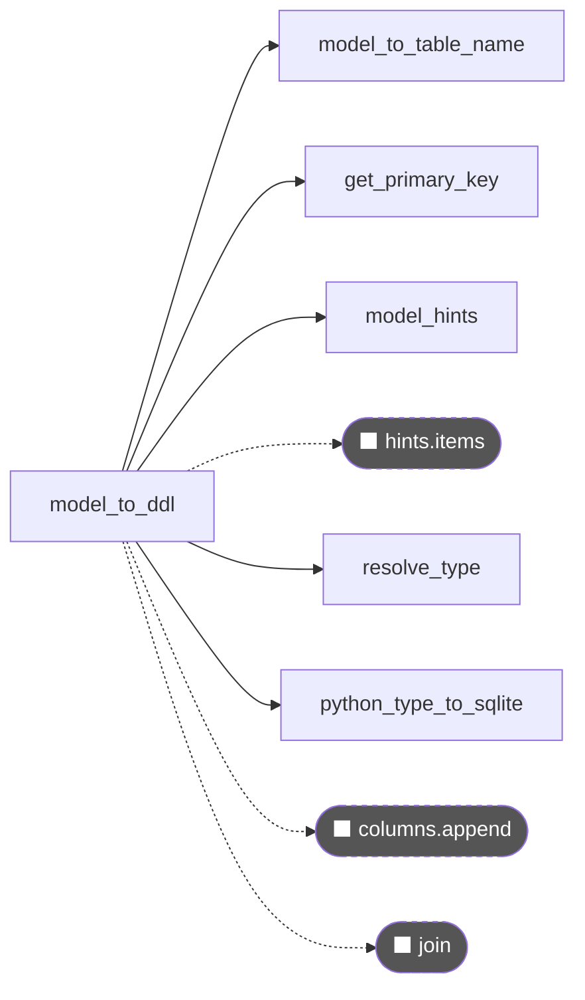


---

#### C022 🟡 `is_indexed`

> `_types.py` L17-L23 | cc=4 | taint=.→T
> 呼び出し元: `model_to_indexes`

**シグネチャ**:
```
is_indexed(annotation) -> tuple[bool, bool]  [cc=4] [.→T]
```

**呼び出しグラフ**:
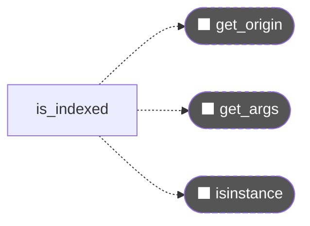


### ⬜ SKIP 読まなくてよい チャンク群


---

#### C005 ⬜ `NyanConnection.changes`

> `_connection.py` L101-L106 | cc=3 | taint=.→.

**シグネチャ**:
```
NyanConnection.changes(self) -> int  [cc=3] [.→.]
```

**呼び出しグラフ**:
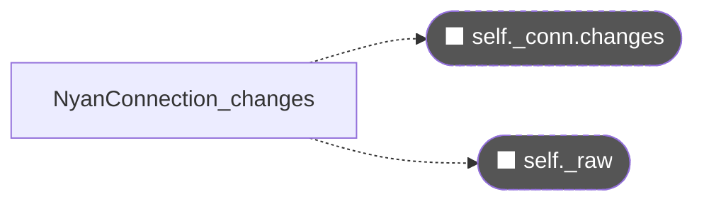


---

#### C017 ⬜ `get_primary_key`

> `_schema.py` L23-L30 | cc=3 | taint=.→T
> 呼び出し元: `model_to_ddl`, `model_to_indexes`, `NyanSQLite.register`

**シグネチャ**:
```
get_primary_key(model) -> Optional[str]  [cc=3] [.→T]
```

**呼び出しグラフ**:
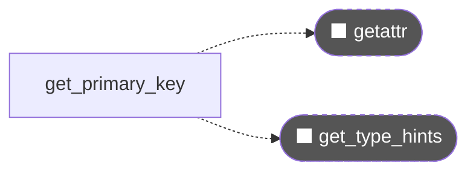


---

#### C023 ⬜ `is_searchable`

> `_types.py` L26-L29 | cc=3 | taint=.→.
> 呼び出し元: `model_to_fts5`, `NyanSQLite.register`

**シグネチャ**:
```
is_searchable(annotation) -> bool  [cc=3] [.→.]
```

**呼び出しグラフ**:
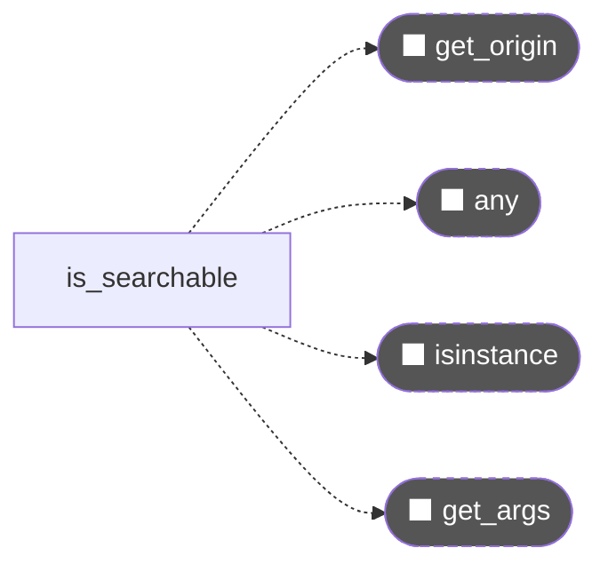


---

#### C031 ⬜ `_order_sql`

> `core.py` L122-L125 | cc=3 | taint=T→T
> 呼び出し元: `NyanSQLite.query`, `NyanSQLite.select`

**シグネチャ**:
```
_order_sql(order_by, desc) -> str  [cc=3] [T→T]
```

**呼び出しグラフ**:
```mermaid
graph LR
    classDef external fill:#555,color:#fff,stroke-dasharray:4
```


---

#### C032 ⬜ `_limit_sql`

> `core.py` L128-L134 | cc=3 | taint=.→T
> 呼び出し元: `NyanSQLite.query`, `NyanSQLite.select`, `NyanSQLite.search`

**シグネチャ**:
```
_limit_sql(limit, offset) -> str  [cc=3] [.→T]
```

**呼び出しグラフ**:


---

#### C034 ⬜ `_Meta.check_fields`

> `core.py` L156-L162 | cc=3 | taint=.→.

**シグネチャ**:
```
_Meta.check_fields(self, fields, model_name) -> None  [cc=3] [.→.]
```

**呼び出しグラフ**:
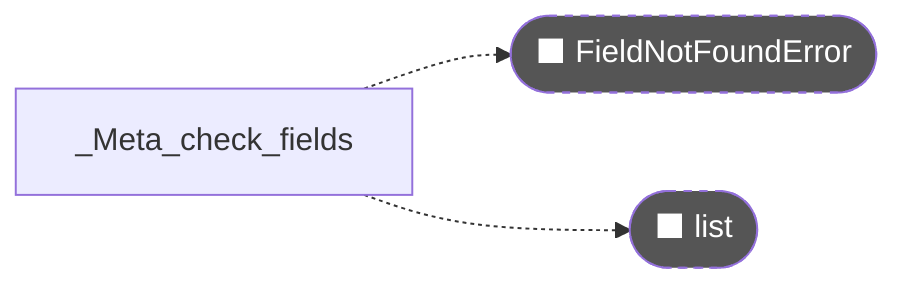


---

#### C038 ⬜ `NyanSQLite._to_row`

> `core.py` L254-L257 | cc=3 | taint=.→T

**シグネチャ**:
```
NyanSQLite._to_row(self, obj, meta) -> dict[str, Any]  [cc=3] [.→T]
```

**呼び出しグラフ**:
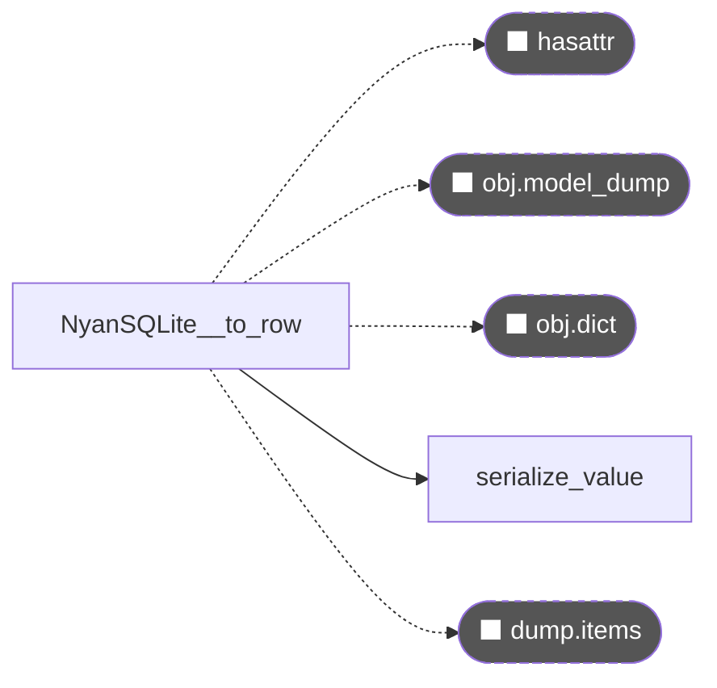


---

#### C042 ⬜ `NyanSQLite.update`

> `core.py` L294-L325 | cc=3 | taint=T→.

**シグネチャ**:
```
NyanSQLite.update(self, model, where) -> int  [cc=3] [T→.]
```

**呼び出しグラフ**:
```mermaid
graph LR
    EXT_self__meta(["⬛ self._meta"]):::external
    NyanSQLite_update -.-> EXT_self__meta
    EXT_meta_check_fields(["⬛ meta.check_fields"]):::external
    NyanSQLite_update -.-> EXT_meta_check_fields
    EXT_list(["⬛ list"]):::external
    NyanSQLite_update -.-> EXT_list
    EXT_fields_items(["⬛ fields.items"]):::external
    NyanSQLite_update -.-> EXT_fields_items
    EXT_set_parts_append(["⬛ set_parts.append"]):::external
    NyanSQLite_update -.-> EXT_set_parts_append
    EXT_set_vals_append(["⬛ set_vals.append"]):::external
    NyanSQLite_update -.-> EXT_set_vals_append
    NyanSQLite_update --> serialize_value["serialize_value"]
    NyanSQLite_update --> _build_where["_build_where"]
    EXT_join(["⬛ join"]):::external
    NyanSQLite_update -.-> EXT_join
    EXT_self__conn_transaction(["⬛ self._conn.transaction"]):::external
    NyanSQLite_update -.-> EXT_self__conn_transaction
    EXT_self__conn_execute(["⬛ self._conn.execute"]):::external
    NyanSQLite_update -.-> EXT_self__conn_execute
    EXT_tuple(["⬛ tuple"]):::external
    NyanSQLite_update -.-> EXT_tuple
    EXT_self__conn_changes(["⬛ self._conn.changes"]):::external
    NyanSQLite_update -.-> EXT_self__conn_changes
    classDef external fill:#555,color:#fff,stroke-dasharray:4
```


---

#### C045 ⬜ `NyanSQLite.query`

> `core.py` L360-L396 | cc=3 | taint=.→T

**シグネチャ**:
```
NyanSQLite.query(self, model) -> list[M]  [cc=3] [.→T]
```

**呼び出しグラフ**:
```mermaid
graph LR
    EXT_self__meta(["⬛ self._meta"]):::external
    NyanSQLite_query -.-> EXT_self__meta
    NyanSQLite_query --> _build_where["_build_where"]
    EXT_meta_check_fields(["⬛ meta.check_fields"]):::external
    NyanSQLite_query -.-> EXT_meta_check_fields
    NyanSQLite_query --> _order_sql["_order_sql"]
    NyanSQLite_query --> _limit_sql["_limit_sql"]
    EXT_self__conn_execute(["⬛ self._conn.execute"]):::external
    NyanSQLite_query -.-> EXT_self__conn_execute
    EXT_tuple(["⬛ tuple"]):::external
    NyanSQLite_query -.-> EXT_tuple
    EXT_self__from_row(["⬛ self._from_row"]):::external
    NyanSQLite_query -.-> EXT_self__from_row
    classDef external fill:#555,color:#fff,stroke-dasharray:4
```


---

#### C047 ⬜ `NyanSQLite.search`

> `core.py` L441-L479 | cc=3 | taint=T→T

**シグネチャ**:
```
NyanSQLite.search(self, model, query) -> list[M]  [cc=3] [T→T]
```

**呼び出しグラフ**:
```mermaid
graph LR
    EXT_self__meta(["⬛ self._meta"]):::external
    NyanSQLite_search -.-> EXT_self__meta
    EXT_SearchNotEnabledError(["⬛ SearchNotEnabledError"]):::external
    NyanSQLite_search -.-> EXT_SearchNotEnabledError
    NyanSQLite_search --> _limit_sql["_limit_sql"]
    EXT_self__conn_execute(["⬛ self._conn.execute"]):::external
    NyanSQLite_search -.-> EXT_self__conn_execute
    EXT_self__from_row(["⬛ self._from_row"]):::external
    NyanSQLite_search -.-> EXT_self__from_row
    classDef external fill:#555,color:#fff,stroke-dasharray:4
```


---

#### C003 ⬜ `NyanConnection.executemany`

> `_connection.py` L81-L85 | cc=2 | taint=T→.

**シグネチャ**:
```
NyanConnection.executemany(self, sql, rows) -> None  [cc=2] [T→.]
```

**呼び出しグラフ**:
```mermaid
graph LR
    EXT_self__conn_cursor_executemany(["⬛ self._conn.cursor.executemany"]):::external
    NyanConnection_executemany -.-> EXT_self__conn_cursor_executemany
    EXT_self__conn_cursor(["⬛ self._conn.cursor"]):::external
    NyanConnection_executemany -.-> EXT_self__conn_cursor
    EXT_self__conn_executemany(["⬛ self._conn.executemany"]):::external
    NyanConnection_executemany -.-> EXT_self__conn_executemany
    classDef external fill:#555,color:#fff,stroke-dasharray:4
```


---

#### C004 ⬜ `NyanConnection.transaction`

> `_connection.py` L90-L97 | cc=2 | taint=.→T

**シグネチャ**:
```
NyanConnection.transaction(self) -> Generator[None, None, None]  [cc=2] [.→T]
```

**呼び出しグラフ**:
```mermaid
graph LR
    EXT_self__raw(["⬛ self._raw"]):::external
    NyanConnection_transaction -.-> EXT_self__raw
    classDef external fill:#555,color:#fff,stroke-dasharray:4
```


---

#### C014 ⬜ `CompositeIndex.__init__`

> `_markers.py` L76-L80 | cc=2 | taint=.→.

**シグネチャ**:
```
CompositeIndex.__init__(self) -> ?  [cc=2] [.→.]
```

**呼び出しグラフ**:
```mermaid
graph LR
    EXT_ValueError(["⬛ ValueError"]):::external
    CompositeIndex___init__ -.-> EXT_ValueError
    classDef external fill:#555,color:#fff,stroke-dasharray:4
```


---

#### C015 ⬜ `CompositeIndex.__repr__`

> `_markers.py` L82-L84 | cc=2 | taint=.→T

**シグネチャ**:
```
CompositeIndex.__repr__(self) -> str  [cc=2] [.→T]
```

**呼び出しグラフ**:
```mermaid
graph LR
    EXT_join(["⬛ join"]):::external
    CompositeIndex___repr__ -.-> EXT_join
    classDef external fill:#555,color:#fff,stroke-dasharray:4
```


---

#### C024 ⬜ `unwrap_annotated`

> `_types.py` L32-L36 | cc=2 | taint=.→T
> 呼び出し元: `resolve_type`

**シグネチャ**:
```
unwrap_annotated(annotation) -> Any  [cc=2] [.→T]
```

**呼び出しグラフ**:
```mermaid
graph LR
    EXT_get_origin(["⬛ get_origin"]):::external
    unwrap_annotated -.-> EXT_get_origin
    EXT_get_args(["⬛ get_args"]):::external
    unwrap_annotated -.-> EXT_get_args
    classDef external fill:#555,color:#fff,stroke-dasharray:4
```


---

#### C027 ⬜ `python_type_to_sqlite`

> `_types.py` L75-L80 | cc=2 | taint=.→T
> 呼び出し元: `model_to_ddl`

**シグネチャ**:
```
python_type_to_sqlite(annotation) -> str  [cc=2] [.→T]
```

**呼び出しグラフ**:
```mermaid
graph LR
    python_type_to_sqlite --> resolve_type["resolve_type"]
    EXT_get_origin(["⬛ get_origin"]):::external
    python_type_to_sqlite -.-> EXT_get_origin
    EXT__PY_TO_SQL_get(["⬛ _PY_TO_SQL.get"]):::external
    python_type_to_sqlite -.-> EXT__PY_TO_SQL_get
    classDef external fill:#555,color:#fff,stroke-dasharray:4
```


---

#### C037 ⬜ `NyanSQLite._meta`

> `core.py` L243-L250 | cc=2 | taint=.→T

**シグネチャ**:
```
NyanSQLite._meta(self, model) -> _Meta  [cc=2] [.→T]
```

**呼び出しグラフ**:
```mermaid
graph LR
    EXT_self__registry_get(["⬛ self._registry.get"]):::external
    NyanSQLite__meta -.-> EXT_self__registry_get
    EXT_ModelNotRegisteredError(["⬛ ModelNotRegisteredError"]):::external
    NyanSQLite__meta -.-> EXT_ModelNotRegisteredError
    classDef external fill:#555,color:#fff,stroke-dasharray:4
```


---

#### C039 ⬜ `NyanSQLite._from_row`

> `core.py` L259-L262 | cc=2 | taint=.→T

**シグネチャ**:
```
NyanSQLite._from_row(self, model, meta, row) -> M  [cc=2] [.→T]
```

**呼び出しグラフ**:
```mermaid
graph LR
    NyanSQLite__from_row --> deserialize_value["deserialize_value"]
    EXT_row_items(["⬛ row.items"]):::external
    NyanSQLite__from_row -.-> EXT_row_items
    EXT_model(["⬛ model"]):::external
    NyanSQLite__from_row -.-> EXT_model
    classDef external fill:#555,color:#fff,stroke-dasharray:4
```


---

#### C040 ⬜ `NyanSQLite.insert`

> `core.py` L266-L276 | cc=2 | taint=.→T

**シグネチャ**:
```
NyanSQLite.insert(self, obj) -> M  [cc=2] [.→T]
```

**呼び出しグラフ**:
```mermaid
graph LR
    EXT_self__meta(["⬛ self._meta"]):::external
    NyanSQLite_insert -.-> EXT_self__meta
    EXT_type(["⬛ type"]):::external
    NyanSQLite_insert -.-> EXT_type
    EXT_self__to_row(["⬛ self._to_row"]):::external
    NyanSQLite_insert -.-> EXT_self__to_row
    EXT_join(["⬛ join"]):::external
    NyanSQLite_insert -.-> EXT_join
    EXT_len(["⬛ len"]):::external
    NyanSQLite_insert -.-> EXT_len
    EXT_self__conn_transaction(["⬛ self._conn.transaction"]):::external
    NyanSQLite_insert -.-> EXT_self__conn_transaction
    EXT_self__conn_execute(["⬛ self._conn.execute"]):::external
    NyanSQLite_insert -.-> EXT_self__conn_execute
    EXT_tuple(["⬛ tuple"]):::external
    NyanSQLite_insert -.-> EXT_tuple
    EXT_row_values(["⬛ row.values"]):::external
    NyanSQLite_insert -.-> EXT_row_values
    classDef external fill:#555,color:#fff,stroke-dasharray:4
```


---

#### C044 ⬜ `NyanSQLite.get`

> `core.py` L348-L358 | cc=2 | taint=.→T

**シグネチャ**:
```
NyanSQLite.get(self, model) -> Optional[M]  [cc=2] [.→T]
```

**呼び出しグラフ**:
```mermaid
graph LR
    EXT_self_query(["⬛ self.query"]):::external
    NyanSQLite_get -.-> EXT_self_query
    classDef external fill:#555,color:#fff,stroke-dasharray:4
```


---

#### C048 ⬜ `NyanSQLite.count`

> `core.py` L483-L497 | cc=2 | taint=.→.

**シグネチャ**:
```
NyanSQLite.count(self, model) -> int  [cc=2] [.→.]
```

**呼び出しグラフ**:
```mermaid
graph LR
    EXT_self__meta(["⬛ self._meta"]):::external
    NyanSQLite_count -.-> EXT_self__meta
    NyanSQLite_count --> _build_where["_build_where"]
    EXT_self__conn_execute(["⬛ self._conn.execute"]):::external
    NyanSQLite_count -.-> EXT_self__conn_execute
    EXT_tuple(["⬛ tuple"]):::external
    NyanSQLite_count -.-> EXT_tuple
    classDef external fill:#555,color:#fff,stroke-dasharray:4
```


---

#### C050 ⬜ `NyanSQLite.rebuild_fts`

> `core.py` L517-L525 | cc=2 | taint=.→.

**シグネチャ**:
```
NyanSQLite.rebuild_fts(self, model) -> None  [cc=2] [.→.]
```

**呼び出しグラフ**:
```mermaid
graph LR
    EXT_self__meta(["⬛ self._meta"]):::external
    NyanSQLite_rebuild_fts -.-> EXT_self__meta
    EXT_self__conn_execute(["⬛ self._conn.execute"]):::external
    NyanSQLite_rebuild_fts -.-> EXT_self__conn_execute
    classDef external fill:#555,color:#fff,stroke-dasharray:4
```


---

#### C057 ⬜ `NyanSQLite.registered_models`

> `core.py` L559-L561 | cc=2 | taint=.→T

**シグネチャ**:
```
NyanSQLite.registered_models(self) -> list[str]  [cc=2] [.→T]
```

**呼び出しグラフ**:
```mermaid
graph LR
    classDef external fill:#555,color:#fff,stroke-dasharray:4
```


---

#### C002 ⬜ `NyanConnection.execute`

> `_connection.py` L78-L79 | cc=1 | taint=T→T

**シグネチャ**:
```
NyanConnection.execute(self, sql, params) -> list[dict[str, Any]]  [cc=1] [T→T]
```

**呼び出しグラフ**:
```mermaid
graph LR
    EXT_self__raw(["⬛ self._raw"]):::external
    NyanConnection_execute -.-> EXT_self__raw
    classDef external fill:#555,color:#fff,stroke-dasharray:4
```


---

#### C006 ⬜ `NyanConnection.close`

> `_connection.py` L108-L109 | cc=1 | taint=.→.

**シグネチャ**:
```
NyanConnection.close(self) -> None  [cc=1] [.→.]
```

**呼び出しグラフ**:
```mermaid
graph LR
    EXT_self__conn_close(["⬛ self._conn.close"]):::external
    NyanConnection_close -.-> EXT_self__conn_close
    classDef external fill:#555,color:#fff,stroke-dasharray:4
```


---

#### C007 ⬜ `NyanConnection.backend`

> `_connection.py` L112-L113 | cc=1 | taint=.→T

**シグネチャ**:
```
NyanConnection.backend(self) -> str  [cc=1] [.→T]
```

**呼び出しグラフ**:
```mermaid
graph LR
    classDef external fill:#555,color:#fff,stroke-dasharray:4
```


---

#### C008 ⬜ `_NyanIndexedMarker.__init__`

> `_markers.py` L7-L8 | cc=1 | taint=.→.

**シグネチャ**:
```
_NyanIndexedMarker.__init__(self, unique) -> ?  [cc=1] [.→.]
```

**呼び出しグラフ**:
```mermaid
graph LR
    classDef external fill:#555,color:#fff,stroke-dasharray:4
```


---

#### C009 ⬜ `_NyanIndexedMarker.__repr__`

> `_markers.py` L10-L11 | cc=1 | taint=.→T

**シグネチャ**:
```
_NyanIndexedMarker.__repr__(self) -> str  [cc=1] [.→T]
```

**呼び出しグラフ**:
```mermaid
graph LR
    classDef external fill:#555,color:#fff,stroke-dasharray:4
```


---

#### C010 ⬜ `_NyanSearchableMarker.__repr__`

> `_markers.py` L15-L16 | cc=1 | taint=.→T

**シグネチャ**:
```
_NyanSearchableMarker.__repr__(self) -> str  [cc=1] [.→T]
```

**呼び出しグラフ**:
```mermaid
graph LR
    classDef external fill:#555,color:#fff,stroke-dasharray:4
```


---

#### C011 ⬜ `Indexed.__class_getitem__`

> `_markers.py` L28-L30 | cc=1 | taint=.→.

**シグネチャ**:
```
Indexed.__class_getitem__(cls, item) -> ?  [cc=1] [.→.]
```

**呼び出しグラフ**:
```mermaid
graph LR
    EXT__NyanIndexedMarker(["⬛ _NyanIndexedMarker"]):::external
    Indexed___class_getitem__ -.-> EXT__NyanIndexedMarker
    classDef external fill:#555,color:#fff,stroke-dasharray:4
```


---

#### C012 ⬜ `UniqueIndexed.__class_getitem__`

> `_markers.py` L41-L43 | cc=1 | taint=.→.

**シグネチャ**:
```
UniqueIndexed.__class_getitem__(cls, item) -> ?  [cc=1] [.→.]
```

**呼び出しグラフ**:
```mermaid
graph LR
    EXT__NyanIndexedMarker(["⬛ _NyanIndexedMarker"]):::external
    UniqueIndexed___class_getitem__ -.-> EXT__NyanIndexedMarker
    classDef external fill:#555,color:#fff,stroke-dasharray:4
```


---

#### C013 ⬜ `Searchable.__class_getitem__`

> `_markers.py` L55-L57 | cc=1 | taint=.→.

**シグネチャ**:
```
Searchable.__class_getitem__(cls, item) -> ?  [cc=1] [.→.]
```

**呼び出しグラフ**:
```mermaid
graph LR
    EXT__NyanSearchableMarker(["⬛ _NyanSearchableMarker"]):::external
    Searchable___class_getitem__ -.-> EXT__NyanSearchableMarker
    classDef external fill:#555,color:#fff,stroke-dasharray:4
```


---

#### C016 ⬜ `model_to_table_name`

> `_schema.py` L18-L20 | cc=1 | taint=.→T
> 呼び出し元: `model_to_ddl`, `model_to_indexes`, `model_to_fts5`, `NyanSQLite.register`

**シグネチャ**:
```
model_to_table_name(model) -> str  [cc=1] [.→T]
```

**呼び出しグラフ**:
```mermaid
graph LR
    EXT_re_sub_lower(["⬛ re.sub.lower"]):::external
    model_to_table_name -.-> EXT_re_sub_lower
    EXT_re_sub(["⬛ re.sub"]):::external
    model_to_table_name -.-> EXT_re_sub
    classDef external fill:#555,color:#fff,stroke-dasharray:4
```


---

#### C018 ⬜ `model_hints`

> `_schema.py` L33-L34 | cc=1 | taint=.→T
> 呼び出し元: `model_to_ddl`, `model_to_indexes`, `model_to_fts5`, `NyanSQLite.register`

**シグネチャ**:
```
model_hints(model) -> dict[str, Any]  [cc=1] [.→T]
```

**呼び出しグラフ**:
```mermaid
graph LR
    EXT_get_type_hints(["⬛ get_type_hints"]):::external
    model_hints -.-> EXT_get_type_hints
    classDef external fill:#555,color:#fff,stroke-dasharray:4
```


---

#### C026 ⬜ `_is_union_type`

> `_types.py` L55-L57 | cc=1 | taint=.→.
> 呼び出し元: `resolve_type`

**シグネチャ**:
```
_is_union_type(tp) -> bool  [cc=1] [.→.]
```

**呼び出しグラフ**:
```mermaid
graph LR
    EXT_isinstance(["⬛ isinstance"]):::external
    _is_union_type -.-> EXT_isinstance
    EXT_getattr(["⬛ getattr"]):::external
    _is_union_type -.-> EXT_getattr
    EXT_type(["⬛ type"]):::external
    _is_union_type -.-> EXT_type
    classDef external fill:#555,color:#fff,stroke-dasharray:4
```


---

#### C033 ⬜ `_Meta.__init__`

> `core.py` L142-L154 | cc=1 | taint=T→.

**シグネチャ**:
```
_Meta.__init__(self, table, pk, hints, fts_table, fts_fields) -> ?  [cc=1] [T→.]
```

**呼び出しグラフ**:
```mermaid
graph LR
    classDef external fill:#555,color:#fff,stroke-dasharray:4
```


---

#### C035 ⬜ `NyanSQLite.__init__`

> `core.py` L194-L197 | cc=1 | taint=T→.

**シグネチャ**:
```
NyanSQLite.__init__(self, path, wal) -> ?  [cc=1] [T→.]
```

**呼び出しグラフ**:
```mermaid
graph LR
    EXT_NyanConnection(["⬛ NyanConnection"]):::external
    NyanSQLite___init__ -.-> EXT_NyanConnection
    EXT_threading_Lock(["⬛ threading.Lock"]):::external
    NyanSQLite___init__ -.-> EXT_threading_Lock
    classDef external fill:#555,color:#fff,stroke-dasharray:4
```


---

#### C043 ⬜ `NyanSQLite.delete`

> `core.py` L329-L344 | cc=1 | taint=.→.

**シグネチャ**:
```
NyanSQLite.delete(self, model) -> int  [cc=1] [.→.]
```

**呼び出しグラフ**:
```mermaid
graph LR
    EXT_self__meta(["⬛ self._meta"]):::external
    NyanSQLite_delete -.-> EXT_self__meta
    NyanSQLite_delete --> _build_where["_build_where"]
    EXT_self__conn_transaction(["⬛ self._conn.transaction"]):::external
    NyanSQLite_delete -.-> EXT_self__conn_transaction
    EXT_self__conn_execute(["⬛ self._conn.execute"]):::external
    NyanSQLite_delete -.-> EXT_self__conn_execute
    EXT_tuple(["⬛ tuple"]):::external
    NyanSQLite_delete -.-> EXT_tuple
    EXT_self__conn_changes(["⬛ self._conn.changes"]):::external
    NyanSQLite_delete -.-> EXT_self__conn_changes
    classDef external fill:#555,color:#fff,stroke-dasharray:4
```


---

#### C049 ⬜ `NyanSQLite.exists`

> `core.py` L499-L513 | cc=1 | taint=.→.

**シグネチャ**:
```
NyanSQLite.exists(self, model) -> bool  [cc=1] [.→.]
```

**呼び出しグラフ**:
```mermaid
graph LR
    EXT_self__meta(["⬛ self._meta"]):::external
    NyanSQLite_exists -.-> EXT_self__meta
    NyanSQLite_exists --> _build_where["_build_where"]
    EXT_bool(["⬛ bool"]):::external
    NyanSQLite_exists -.-> EXT_bool
    EXT_self__conn_execute(["⬛ self._conn.execute"]):::external
    NyanSQLite_exists -.-> EXT_self__conn_execute
    EXT_tuple(["⬛ tuple"]):::external
    NyanSQLite_exists -.-> EXT_tuple
    classDef external fill:#555,color:#fff,stroke-dasharray:4
```


---

#### C051 ⬜ `NyanSQLite.vacuum`

> `core.py` L527-L529 | cc=1 | taint=.→.

**シグネチャ**:
```
NyanSQLite.vacuum(self) -> None  [cc=1] [.→.]
```

**呼び出しグラフ**:
```mermaid
graph LR
    EXT_self__conn_execute(["⬛ self._conn.execute"]):::external
    NyanSQLite_vacuum -.-> EXT_self__conn_execute
    classDef external fill:#555,color:#fff,stroke-dasharray:4
```


---

#### C052 ⬜ `NyanSQLite.execute_raw`

> `core.py` L533-L540 | cc=1 | taint=T→T

**シグネチャ**:
```
NyanSQLite.execute_raw(self, sql, params) -> list[dict[str, Any]]  [cc=1] [T→T]
```

**呼び出しグラフ**:
```mermaid
graph LR
    EXT_self__conn_execute(["⬛ self._conn.execute"]):::external
    NyanSQLite_execute_raw -.-> EXT_self__conn_execute
    classDef external fill:#555,color:#fff,stroke-dasharray:4
```


---

#### C053 ⬜ `NyanSQLite.__enter__`

> `core.py` L544-L545 | cc=1 | taint=.→T

**シグネチャ**:
```
NyanSQLite.__enter__(self) -> NyanSQLite  [cc=1] [.→T]
```

**呼び出しグラフ**:
```mermaid
graph LR
    classDef external fill:#555,color:#fff,stroke-dasharray:4
```


---

#### C054 ⬜ `NyanSQLite.__exit__`

> `core.py` L547-L548 | cc=1 | taint=.→.

**シグネチャ**:
```
NyanSQLite.__exit__(self) -> None  [cc=1] [.→.]
```

**呼び出しグラフ**:
```mermaid
graph LR
    EXT_self_close(["⬛ self.close"]):::external
    NyanSQLite___exit__ -.-> EXT_self_close
    classDef external fill:#555,color:#fff,stroke-dasharray:4
```


---

#### C055 ⬜ `NyanSQLite.close`

> `core.py` L550-L552 | cc=1 | taint=.→.

**シグネチャ**:
```
NyanSQLite.close(self) -> None  [cc=1] [.→.]
```

**呼び出しグラフ**:
```mermaid
graph LR
    EXT_self__conn_close(["⬛ self._conn.close"]):::external
    NyanSQLite_close -.-> EXT_self__conn_close
    classDef external fill:#555,color:#fff,stroke-dasharray:4
```


---

#### C056 ⬜ `NyanSQLite.backend`

> `core.py` L555-L557 | cc=1 | taint=.→T

**シグネチャ**:
```
NyanSQLite.backend(self) -> str  [cc=1] [.→T]
```

**呼び出しグラフ**:
```mermaid
graph LR
    classDef external fill:#555,color:#fff,stroke-dasharray:4
```


---

## [OUTPUT] — 統合レポートの出力フォーマット

> AIはこのフォーマットで統合レポートを1本出力すること。

---

### 🔍 発見サマリーテーブル

| ID | 関数 | カテゴリ | 深刻度 | CWE | BLINDカテゴリ |
|:---|:---|:---|:---:|:---|:---:|
| F-001 | `xxx` | SQLインジェクション | 🔴 CRITICAL | CWE-89 | - |
| F-002 | `xxx` | TOCTOU | 🟠 HIGH | CWE-367 | B1 |

---

### 📋 発見詳細（上位5件）

#### FINDING-001

**関数**: `xxx` (ChunkID: Cxxx)
**深刻度**: CRITICAL / HIGH / MEDIUM / LOW
**カテゴリ**: SQLi / TOCTOU / 情報漏洩 / 暗号化不備 / 状態不整合
**CWE**: CWE-xxx

**攻撃シナリオ**:
```
Step 1: 攻撃者が xxx を呼び出す
Step 2: xxx が xxx の状態を利用して
Step 3: xxx が実行される
Step 4: 結果として xxx が達成される
```

**根本原因**:
```
問題のある呼び出し: xxx → xxx
ガード条件の欠落: xxx
```

**修正方針**:
```python
# 修正前（問題）
def xxx(self, input):
    self.execute(f"SELECT * FROM {input}")   # 直接埋め込み

# 修正後
def xxx(self, input):
    safe = self._sanitize_identifier(input)
    self.execute("SELECT * FROM ?", (safe,))
```

**副作用リスク**: xxx への影響、後方互換性 xxx

---

### 🕳️ BLINDカテゴリへのコメント

| カテゴリ | AIによる評価 | 深刻度 |
|:---|:---|:---:|
| B1: V2Engine×キャッシュ競合 | （推論結果） | ? |
| B2: Hookチェーンの原子性 | （推論結果） | ? |
| B3: WeakrefのGCハザード | （推論結果） | ? |
| B4: lru_cache汚染 | （推論結果） | ? |
| B5: Thread×asyncio混在 | （推論結果） | ? |
| B6: DLQ情報漏洩 | （推論結果） | ? |
| B7: atexit競合 | （推論結果） | ? |

---

### 📌 追加調査推奨箇所

```
AIが判断できなかった箇所（ソースコード確認が必要）:
  1. xxx → 理由: シグネチャのみでは判断不能
  2. xxx → 理由: 外部ライブラリの実装が不明
```

---
*Security Report v6 AI-Native | generated: 2026-05-15 21:00:15*